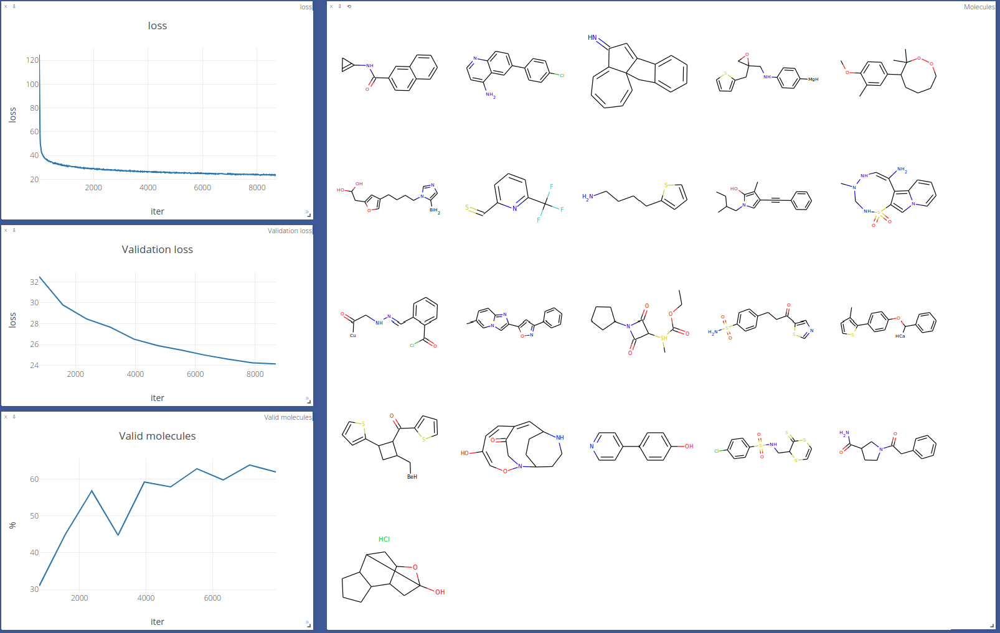

# Implementation of Learning Deep Generative Models of Graphs in PyTorch

For the paper, see: [[1803.03324] Learning Deep Generative Models of Graphs](https://arxiv.org/abs/1803.03324)

Implementation is batched and can process roughly 10k molecules/minute with batch size of 128.

## Results

This implementation reaches ~72% of valid molecules generated  (instead of 97.5% reported in the paper) with a loss of 19.5 (instead 20.5 of theirs). The reason for the difference might be:
 * Different method of validation - they did not specify how they do it. This implementation uses Chem.SanitizeMol() function of RDKit
 * What to do with multiple edge additions? Ignore them? Mask them out in time of choosing the destination atom? This implementation counts them as invalid.
 * What exact parameters are shared among the propagators/aggregators and which of them is custom?
 * Where do they apply the dropout to? They say they apply it to the last layer of output modules. What is an output module? Applying it directly before the decisions make no sense.
 * Molecules are not uniquely represented by their graph. They also need the "NumExplicitHs" and "FormalCharge" attributes because of kekulization and because hydrogen atoms are not represented in the graph. What do they do with these? In this implementation it is just filtered out.
 * It is not specified which version of Chembl they are using.

Having lower validation loss while having significantly lower number of valid molecules indicates a different way of validating molecules. Achieving 97.5% valid graphs seems to be quiet astonishing, considering the fact that every single choice in the decision problem could very easily result in an invalid molecule.

## How to use it

```bash
./main.py -save_dir <train dir> -gpu 0
```

For more options, check out main.py.

## Visualization during training



## Requirements

Tested with Python 3, PyTorch 1.1 and RDKit 2018.09.1. Others can be installed by running pip3 -r requirements.txt.

## License

The software is under Apache 2.0 license. See http://www.apache.org/licenses/LICENSE-2.0 for further details.